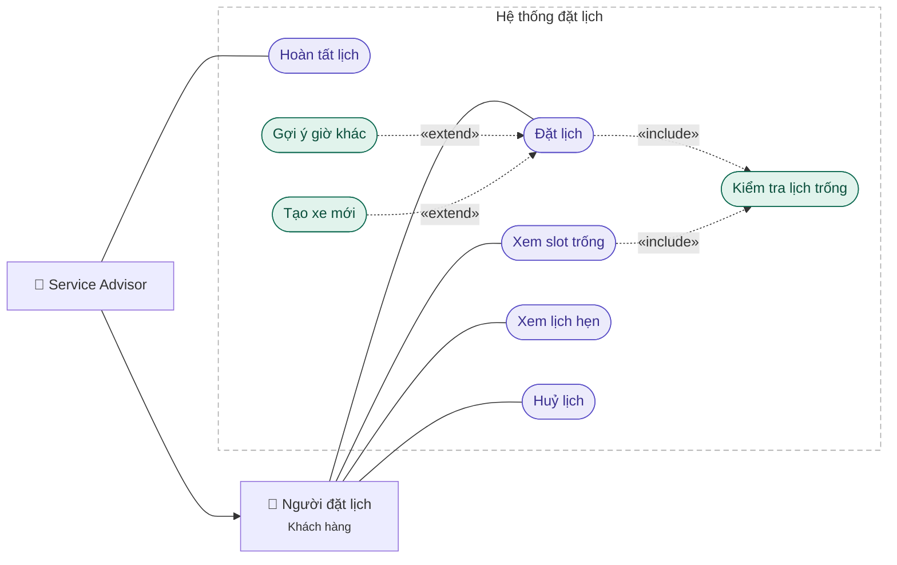

# The unified Service Scheduler

## Use-case Diagram

```mermaid
flowchart LR
    advisor["👤 Service Advisor"]
    booker["👤 Người đặt lịch<br/><small>Khách hàng</small>"]

    subgraph system["Hệ thống đặt lịch"]
        datLich(["Đặt lịch"])
        xemSlot(["Xem slot trống"])
        xemLich(["Xem lịch hẹn"])
        huyLich(["Huỷ lịch"])
        hoanTat(["Hoàn tất lịch"])
        goiY(["Gợi ý giờ khác"])
        kiemTra(["Kiểm tra lịch trống"])
        taoXe(["Tạo xe mới"])
    end

    advisor --> booker
    advisor --- hoanTat

    booker --- datLich
    booker --- xemSlot
    booker --- xemLich
    booker --- huyLich

    datLich -.->|"«include»"| kiemTra
    xemSlot -.->|"«include»"| kiemTra
    goiY -.->|"«extend»"| datLich
    taoXe -.->|"«extend»"| datLich

    classDef primary fill:#ECEBFB,stroke:#5B4FC7,color:#3A2F8F
    classDef secondary fill:#E1F3EC,stroke:#0F6B52,color:#0B4F3C
    class datLich,xemSlot,xemLich,huyLich,hoanTat primary
    class goiY,kiemTra,taoXe secondary
    style system fill:none,stroke:#AAAAAA,stroke-dasharray:6 4
```